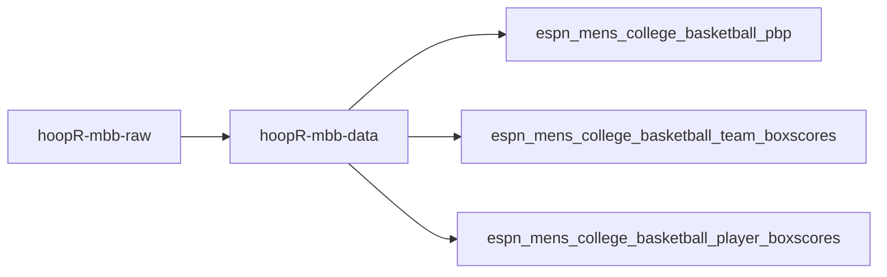
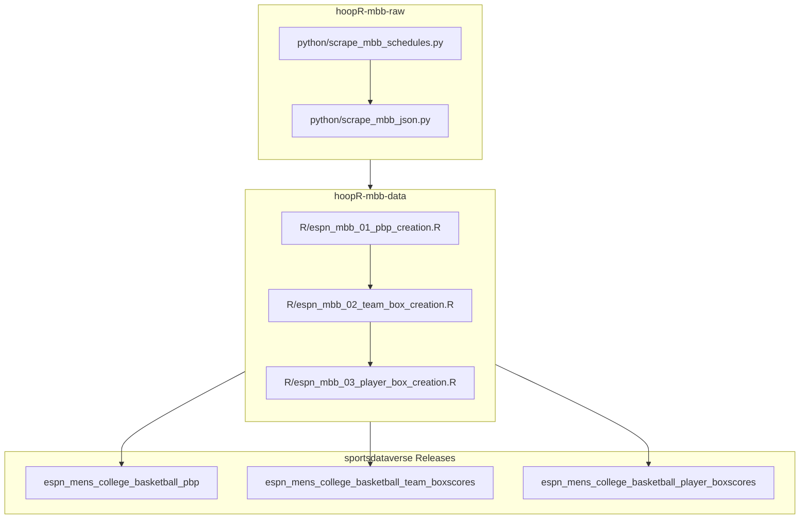

# hoopR-mbb-data
hoopR Men's College Basketball Data 2003 - Present

## hoopR ESPN MBB workflow diagram

## Stage numbering

`R/espn_mbb_NN_*.R` stage numbers are stable identifiers aligned across the
sibling hoopR/wehoop data repos, so holes are expected — `08` is intentionally
vacant here (it maps to the NBA-only draft dataset,
`espn_nba_08_draft_creation.R` in hoopR-nba-data). Never renumber existing
stages to close a hole.

[hoopR-nba-raw data repository (source: ESPN)](https://github.com/sportsdataverse/hoopR-nba-raw)

[hoopR-nba-data repository (source: ESPN)](https://github.com/sportsdataverse/hoopR-nba-data)

[hoopR-nba-stats-data Repo (source: NBA Stats)](https://github.com/sportsdataverse/hoopR-nba-stats-data)

[hoopR-mbb-raw data repository (source: ESPN)](https://github.com/sportsdataverse/hoopR-mbb-raw)

[hoopR-mbb-data repository (source: ESPN)](https://github.com/sportsdataverse/hoopR-mbb-data)

[hoopR-kp-data Repo (source: KenPom)](https://github.com/sportsdataverse/hoopR-kp-data)

## Datasets

<!-- BEGIN GENERATED: datasets -->
| Script | Dataset | Release tag | Last published |
|---|---|---|---|
| [`R/mbb_11_team_crosswalk_creation.R`](R/mbb_11_team_crosswalk_creation.R) | [`team_crosswalk`](docs/datasets/team_crosswalk.md) | [`mbb_crosswalk`](https://github.com/sportsdataverse/sportsdataverse-data/releases/tag/mbb_crosswalk) | 2026-08-07 |
| [`R/mbb_12_schedule_crosswalk_creation.R`](R/mbb_12_schedule_crosswalk_creation.R) | [`schedule_crosswalk`](docs/datasets/schedule_crosswalk.md) | [`mbb_crosswalk`](https://github.com/sportsdataverse/sportsdataverse-data/releases/tag/mbb_crosswalk) | 2026-08-07 |
| [`python/espn_mbb_01_pbp_creation.py`](python/espn_mbb_01_pbp_creation.py) | [`pbp`](docs/datasets/pbp.md) | [`espn_mens_college_basketball_pbp`](https://github.com/sportsdataverse/sportsdataverse-data/releases/tag/espn_mens_college_basketball_pbp) | 2026-08-07 |
| [`python/espn_mbb_02_team_box_creation.py`](python/espn_mbb_02_team_box_creation.py) | [`team_box`](docs/datasets/team_box.md) | [`espn_mens_college_basketball_team_boxscores`](https://github.com/sportsdataverse/sportsdataverse-data/releases/tag/espn_mens_college_basketball_team_boxscores) | 2026-08-12 |
| [`python/espn_mbb_03_player_box_creation.py`](python/espn_mbb_03_player_box_creation.py) | [`player_box`](docs/datasets/player_box.md) | [`espn_mens_college_basketball_player_boxscores`](https://github.com/sportsdataverse/sportsdataverse-data/releases/tag/espn_mens_college_basketball_player_boxscores) | 2026-08-12 |
| [`python/espn_mbb_04_rosters_creation.py`](python/espn_mbb_04_rosters_creation.py) | [`rosters`](docs/datasets/rosters.md) | [`espn_mens_college_basketball_rosters`](https://github.com/sportsdataverse/sportsdataverse-data/releases/tag/espn_mens_college_basketball_rosters) | 2026-08-12 |
| [`python/espn_mbb_05_player_season_stats_creation.py`](python/espn_mbb_05_player_season_stats_creation.py) | [`player_season_stats`](docs/datasets/player_season_stats.md) | [`espn_mens_college_basketball_player_season_stats`](https://github.com/sportsdataverse/sportsdataverse-data/releases/tag/espn_mens_college_basketball_player_season_stats) | 2026-08-12 |
| [`python/espn_mbb_06_team_season_stats_creation.py`](python/espn_mbb_06_team_season_stats_creation.py) | [`team_season_stats`](docs/datasets/team_season_stats.md) | [`espn_mens_college_basketball_team_season_stats`](https://github.com/sportsdataverse/sportsdataverse-data/releases/tag/espn_mens_college_basketball_team_season_stats) | 2026-08-12 |
| [`python/espn_mbb_07_standings_creation.py`](python/espn_mbb_07_standings_creation.py) | [`standings`](docs/datasets/standings.md) | [`espn_mens_college_basketball_standings`](https://github.com/sportsdataverse/sportsdataverse-data/releases/tag/espn_mens_college_basketball_standings) | 2026-08-12 |
| [`python/espn_mbb_09_game_rosters_creation.py`](python/espn_mbb_09_game_rosters_creation.py) | [`game_rosters`](docs/datasets/game_rosters.md) | [`espn_mens_college_basketball_game_rosters`](https://github.com/sportsdataverse/sportsdataverse-data/releases/tag/espn_mens_college_basketball_game_rosters) | 2026-08-07 |
| [`python/espn_mbb_10_officials_creation.py`](python/espn_mbb_10_officials_creation.py) | [`officials`](docs/datasets/officials.md) | [`espn_mens_college_basketball_officials`](https://github.com/sportsdataverse/sportsdataverse-data/releases/tag/espn_mens_college_basketball_officials) | 2026-08-07 |
| [`python/espn_mbb_13_player_crosswalk_creation.py`](python/espn_mbb_13_player_crosswalk_creation.py) | [`player_crosswalk`](docs/datasets/player_crosswalk.md) | [`mbb_crosswalk`](https://github.com/sportsdataverse/sportsdataverse-data/releases/tag/mbb_crosswalk) | 2026-08-07 |
| [`python/espn_mbb_14_schedules_creation.py`](python/espn_mbb_14_schedules_creation.py) | [`schedules`](docs/datasets/schedules.md) | [`espn_mens_college_basketball_schedules`](https://github.com/sportsdataverse/sportsdataverse-data/releases/tag/espn_mens_college_basketball_schedules) | 2026-08-12 |
| [`python/espn_mbb_15_shots_creation.py`](python/espn_mbb_15_shots_creation.py) | [`shots`](docs/datasets/shots.md) | [`espn_mens_college_basketball_shots`](https://github.com/sportsdataverse/sportsdataverse-data/releases/tag/espn_mens_college_basketball_shots) | 2026-08-12 |
| [`python/espn_mbb_16_player_core_creation.py`](python/espn_mbb_16_player_core_creation.py) | [`player_core`](docs/datasets/player_core.md) | [`espn_mens_college_basketball_player_core`](https://github.com/sportsdataverse/sportsdataverse-data/releases/tag/espn_mens_college_basketball_player_core) | 2026-08-12 |
<!-- END GENERATED: datasets -->
