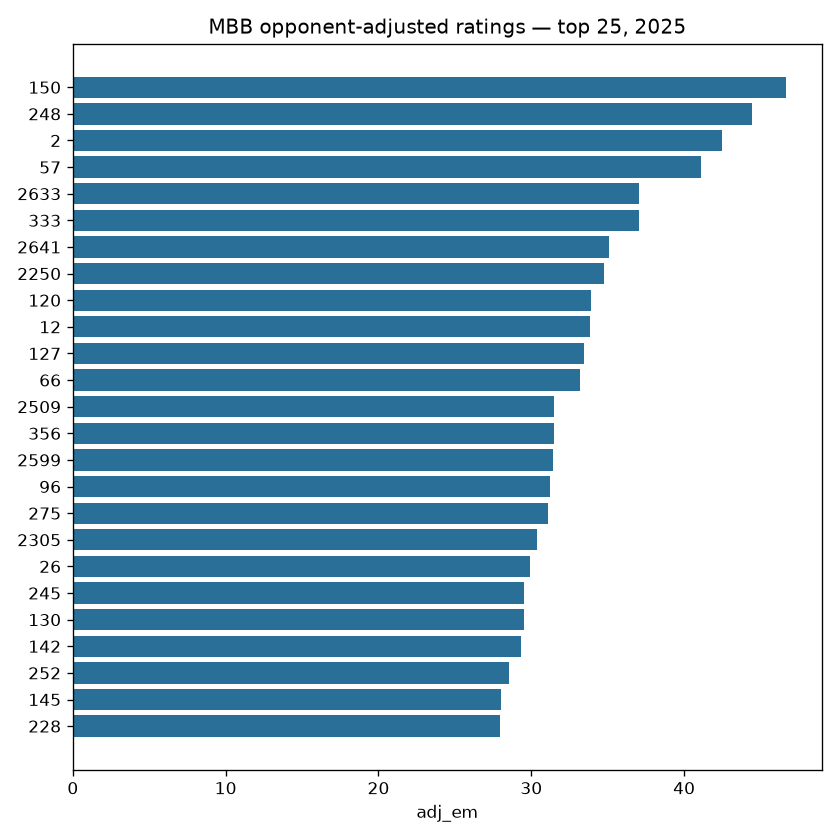
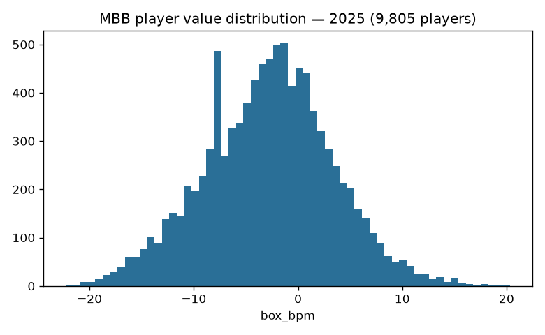
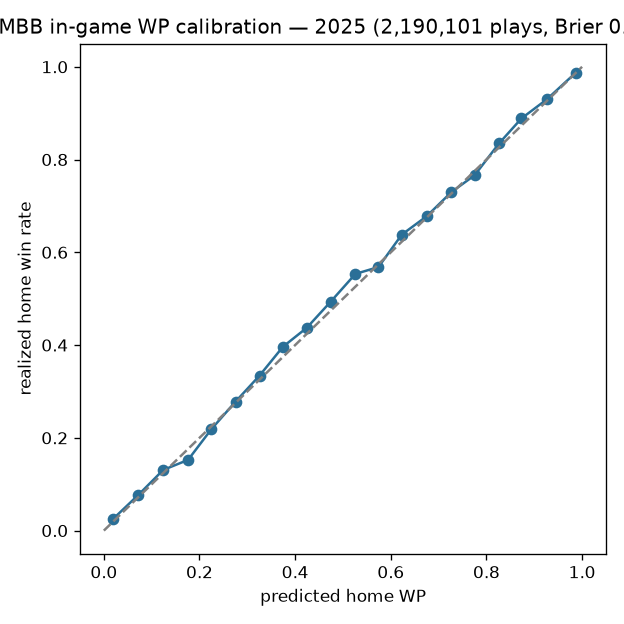

# MBB model surfaces — documentation

Three model surfaces (single home: `models/manifest.yaml`; rows in
`models/REGISTRY.md`):

| surface | tag | stage |
|---|---|---|
| Opponent-adjusted team ratings | `mbb_ratings` | `python/mbb_model_01_ratings.py` |
| Per-player box Plus/Minus (player value) | `mbb_player_value` | `python/mbb_model_02_player_value.py` |
| Per-play WP enrichment of the published pbp | `espn_mens_college_basketball_pbp` (in place) | `python/mbb_model_03_wp_enrich.py` |

## Ratings + player value

Compute-on-demand: the engines live in sdv-py (the MBB prediction stack /
player-value spines, oracle-gated where they are trained); each publish writes
a card sidecar with per-run provenance. Wired via `mbb_models_cron.yml`.

## WP enrichment

The MBB rule-era WP suite (trained + bundled in sdv-py) is applied IN PLACE
to the published season pbp — WP columns added, every original column
preserved. It runs post-publish in `scripts/daily_mbb_data_processor.sh`
because the nightly publish otherwise silently strips the WP columns (that
incident is why the stage exists).

## Evaluation on the published releases (2026-09-01)

### Ratings (2025)

700 teams on `mbb_ratings`.

### Player value (2025)

9,805 players on `mbb_player_value`.

### WP enrichment calibration (2025)

2,190,101 enriched plays from the published pbp: Brier **0.1223**, 20-bin calibration MAE **0.0102** (predicted `home_win_prob` vs the game's realized outcome — a real out-of-band check of the applied model).

Card: [`mbb_models_eval_card.json`](mbb_models_eval_card.json)
