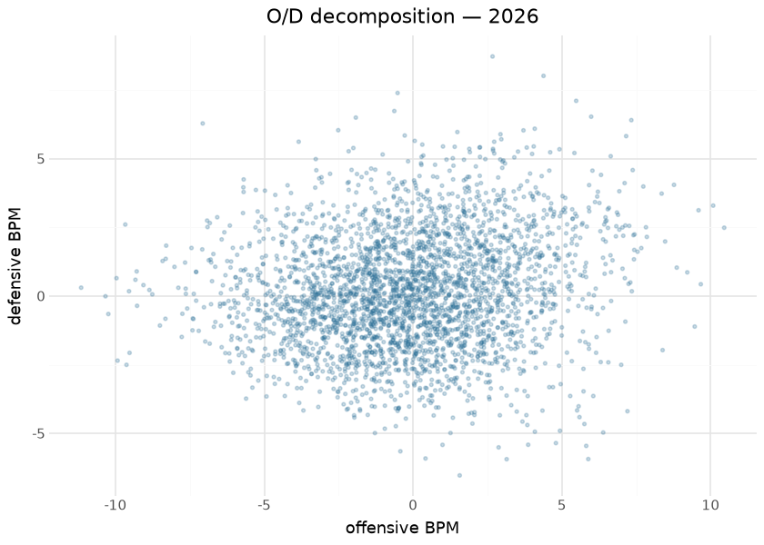

# MBB player value — box Plus/Minus

Per-player box Plus/Minus publishes on the `mbb_player_value` tag
(`box_obpm` / `box_dbpm` / `box_bpm`): a box-score value model over the
published player/team season stats, sharing the design of the MBB
player-value spine in sdv-py (oracle-gated where trained). Box-score
features are regressed onto team-level results to apportion value;
offensive and defensive components are estimated separately and summed.
It is compute-on-demand — every run recomputes from the current
published season assets, so a data correction upstream flows through on
the next publish, and each publish writes a card sidecar.

Box Plus/Minus and on/off RAPM (the `ncaa_mbb_rapm` model in the NCAA
hoops repos) deliberately measure different things: BPM sees only what
reaches the box score and is therefore stable at small samples but blind
to screening, defensive attention, and everything else the box misses;
RAPM sees all of it but drowns in noise for low-minute players. The two
are cross-references, not substitutes — the natural hybrid (an SPM-prior
RAPM, as the NBA impact suite builds) is the catalogued next step.

Everything below is computed at render time from the published release
assets — the exact frames consumers download.

## Training data

| Published mbb_player_value assets, by season |  |  |  |
|----|----|----|----|
| computed at render time from the release |  |  |  |
| season | players | total_minutes | players_300min |
| 2020 | 8770 | 2,324,878 | 2915 |
| 2021 | 6840 | 1,726,023 | 2477 |
| 2022 | 9364 | 2,404,864 | 2971 |
| 2023 | 9717 | 2,509,140 | 3024 |
| 2024 | 9838 | 2,516,161 | 3056 |
| 2025 | 9805 | 2,535,805 | 3065 |
| 2026 | 9990 | 2,539,283 | 3114 |

&#10;

## Exploratory data analysis

The minutes-vs-\|BPM\| funnel is this model’s most important
consumer-facing fact, shown rather than footnoted: the published frame
enforces **no minutes floor**, so the most extreme values in the file
belong to 20-minute seasons. Every table below applies a floor;
consumers must too.

## Attribution

The model is a linear apportionment of team results onto box-score
features, so the published O/D columns are its native attribution — the
scatter above is the decomposition. The fitted coefficient vector lives
with the engine in sdv-py (oracle-gated where trained) rather than in
the published asset; surfacing it alongside the release is listed in the
avenues below.

## Evaluation

| Published-asset checks |  |  |
|----|----|----|
| YoY reliability is the box model's core virtue; a near-zero O/D correlation means the components carry distinct information |  |  |
| check | pairs | pearson |
| box BPM year-over-year (same player, ≥300 min both seasons) | 10110 | 0.750 |
| corr(box_obpm, box_dbpm) — 2026, ≥300 min | 3114 | 0.151 |

&#10;

A box model’s justification is exactly this reliability: with
roster-level churn as violent as college basketball’s, a player metric
that persists season-over-season for returning players is measuring the
player. The engine’s own oracle gates (against the sdv-py player-value
spine’s references) run where the model is trained.

## Results

| Top 15 box BPM — 2026 (min 300 minutes) |  |  |  |  |  |  |
|----|----|----|----|----|----|----|
|  | Player | Team | Min | O-BPM | D-BPM | BPM |
|  | Tobe Awaka | Arizona Wildcats | 809 | 7.33 | 6.40 | 13.73 |
|  | Oscar Cluff | Purdue Boilermakers | 964 | 10.08 | 3.29 | 13.37 |
|  | Morez Johnson Jr. | Michigan Wolverines | 1,005 | 7.16 | 5.82 | 12.98 |
|  | Cameron Boozer | Duke Blue Devils | 1,274 | 10.45 | 2.49 | 12.94 |
|  | Motiejus Krivas | Arizona Wildcats | 984 | 8.77 | 4.05 | 12.81 |
|  | Yaxel Lendeborg | Michigan Wolverines | 1,210 | 9.59 | 3.12 | 12.71 |
|  | Kalifa Sakho | Houston Cougars | 435 | 5.48 | 7.10 | 12.58 |
|  | Rueben Chinyelu | Florida Gators | 856 | 5.98 | 6.53 | 12.51 |
|  | Micah Handlogten | Florida Gators | 504 | 4.38 | 8.01 | 12.39 |
|  | Patrick Ngongba II | Duke Blue Devils | 702 | 8.35 | 3.73 | 12.08 |
|  | Keba Keita | BYU Cougars | 747 | 7.38 | 4.58 | 11.96 |
|  | Ernest Udeh Jr. | Miami Hurricanes | 933 | 6.64 | 5.09 | 11.73 |
|  | Aday Mara | Michigan Wolverines | 935 | 7.73 | 3.99 | 11.72 |
|  | Maliq Brown | Duke Blue Devils | 769 | 2.67 | 8.72 | 11.39 |
|  | Sananda Fru | Louisville Cardinals | 770 | 7.11 | 4.11 | 11.22 |

&#10;

## Provenance & reproducibility

- **Computed from:** this repository’s published player/team season
  stats for the seasons in the corpus table; recomputed in full on every
  run (compute-on-demand — no fitted artifact is stored).
- **Engine:** the MBB player-value spine in sdv-py (oracle-gated where
  trained); O/D estimated separately and summed.
- **Pipeline:** `scripts/mbb_models.sh 02` → stage
  `python/mbb_model_02_player_value.py`; card sidecar
  [`mbb_models_eval_card.json`](mbb_models_eval_card.json). Single home:
  `models/manifest.yaml`.
- **Rebuild this document:** `scripts/render_model_docs.sh` (Quarto →
  GFM; `uv sync --group docs`). Requires network for the release
  download and the ESPN headshot CDN.

## Avenues for improvement & open issues

- **Blend with on/off** — box Plus/Minus and the league-wide RAPM
  measure different things; a stabilized hybrid (SPM-prior RAPM, as the
  NBA impact suite does) is the natural next step.
- **Ship the coefficient vector** — publishing the fitted coefficients
  (or a per-retrain meta sidecar) would let this document show real
  coefficient importance instead of pointing at the engine.
- **Known issue:** no minutes floor is enforced in the published frame —
  consumers must filter low-minute noise themselves (the funnel figure
  above is the demonstration).
