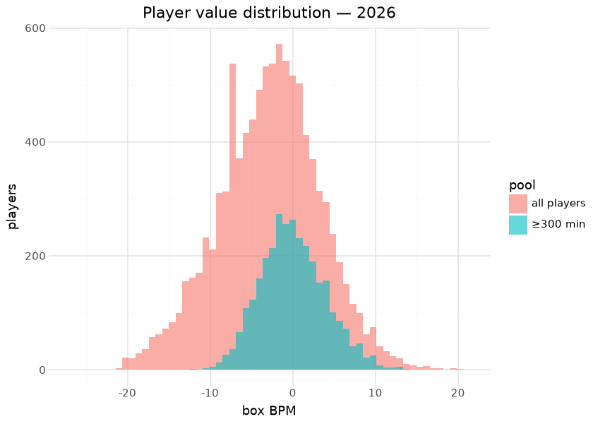
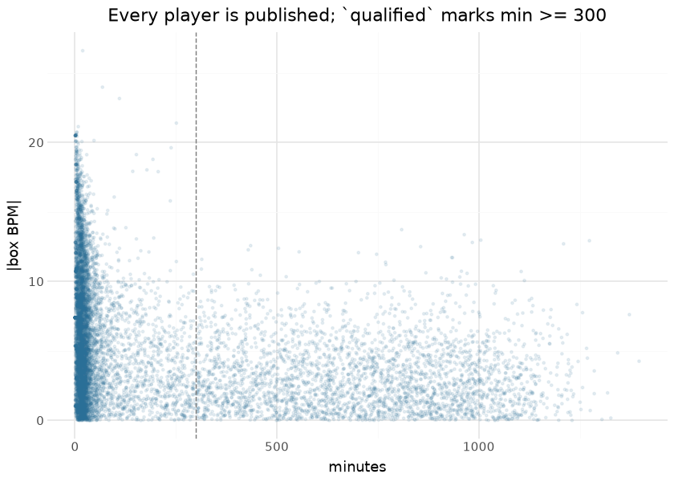
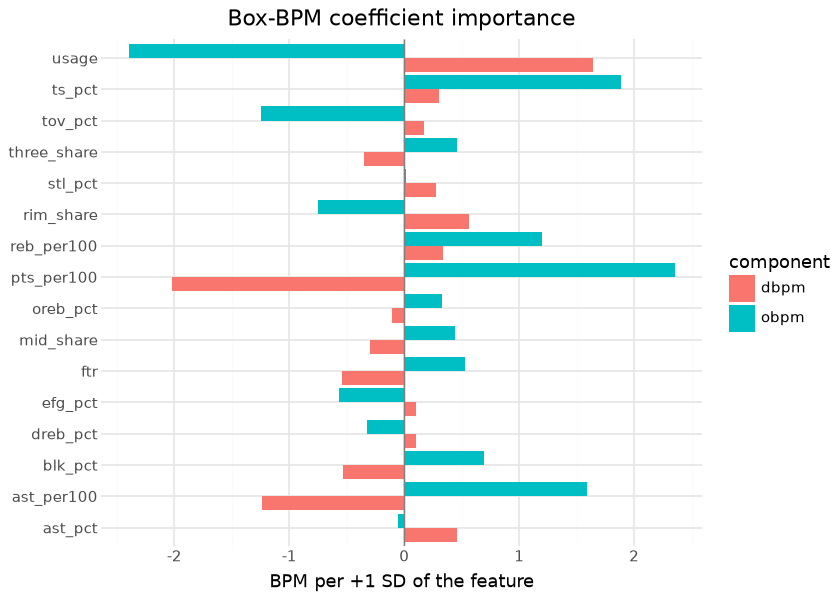

# MBB player value — box Plus/Minus

Per-player box Plus/Minus publishes on the `mbb_player_value` tag
(`box_obpm` / `box_dbpm` / `box_bpm`): a box-score value model over the
published player/team season stats, sharing the design of the MBB
player-value spine in sdv-py (oracle-gated where trained). Per-100 box
features are standardized and scored through ridge coefficients fit at
the team level, then a uniform team adjustment makes each team’s
minutes-weighted player scores sum to its adjusted efficiency margin;
offensive and defensive components are estimated separately and summed.
It is compute-on-demand — every run recomputes from the current
published season assets, so a data correction upstream flows through on
the next publish, and each publish writes a card sidecar plus the fitted
coefficient vector.

Box Plus/Minus and on/off RAPM (the `ncaa_mbb_rapm` model in the NCAA
hoops repos) deliberately measure different things: BPM sees only what
reaches the box score and is therefore stable at small samples but blind
to screening, defensive attention, and everything else the box misses;
RAPM sees all of it but drowns in noise for low-minute players. The two
are cross-references, not substitutes — the natural hybrid (an SPM-prior
RAPM, as the NBA impact suite builds) is the catalogued next step.

Everything below is computed at render time from the published release
assets — the exact frames consumers download.

## Training data

| Published mbb_player_value assets, by season |  |  |  |
|----|----|----|----|
| computed at render time from the release; qualified = min \>= 300 |  |  |  |
| season | players | total_minutes | qualified_players |
| 2014 | 8161 | 2,393,564 | 2911 |
| 2015 | 8301 | 2,391,127 | 2909 |
| 2016 | 8438 | 2,373,935 | 2912 |
| 2017 | 8674 | 2,388,044 | 2907 |
| 2018 | 8724 | 2,421,452 | 2940 |
| 2019 | 8649 | 2,432,949 | 2940 |
| 2020 | 8770 | 2,324,878 | 2915 |
| 2021 | 6840 | 1,726,023 | 2477 |
| 2022 | 9364 | 2,404,864 | 2971 |
| 2023 | 9717 | 2,509,140 | 3024 |
| 2024 | 9838 | 2,516,161 | 3056 |
| 2025 | 9805 | 2,535,805 | 3065 |
| 2026 | 9990 | 2,539,283 | 3114 |

&#10;

## Exploratory data analysis

| How the qualified floor was set — sd(box_bpm) by minutes bin, all published seasons |  |  |  |  |
|----|----|----|----|----|
| the floor is the first bin whose sd sits within 10% of the 600–800 plateau (3.73); every table below uses the flag |  |  |  |  |
| minutes_bin | players | sd_box_bpm | abs_bpm_p99 | vs_600_800_plateau |
| 0-25 | 43,386 | 7.17 | 18.80 | 92% |
| 25-50 | 15,429 | 5.72 | 14.97 | 53% |
| 50-75 | 4,868 | 5.15 | 13.68 | 38% |
| 75-100 | 2,545 | 5.07 | 13.79 | 36% |
| 100-150 | 3,396 | 4.78 | 13.01 | 28% |
| 150-200 | 2,625 | 4.59 | 12.13 | 23% |
| 200-250 | 2,504 | 4.30 | 11.85 | 15% |
| 250-300 | 2,431 | 4.23 | 11.07 | 13% |
| 300-350 | 2,449 | 4.08 | 10.64 | 9% |
| 350-400 | 2,247 | 3.93 | 9.94 | 5% |
| 400-500 | 4,455 | 3.95 | 10.23 | 6% |
| 500-600 | 4,642 | 3.89 | 9.84 | 4% |
| 600-800 | 9,557 | 3.73 | 9.70 | −0% |
| 800-1000 | 9,080 | 3.61 | 9.70 | −3% |
| 1000-1400 | 5,657 | 3.43 | 9.37 | −8% |

&#10;

Flag source in this render: derived at render time as min \>= 300 (the
published frames predate the flag).

The minutes-vs-\|BPM\| funnel is this model’s most important
consumer-facing fact, shown rather than footnoted: the published frame
keeps **every** player, so the most extreme values in the file belong to
20-minute seasons. The additive `qualified` flag encodes the floor the
funnel itself justifies — the bin where the spread of BPM stops
shrinking — so a consumer filters with one boolean instead of
re-deriving a threshold. The engine’s own fit floor (`min_minutes` in
the artifact) governs only the team-sum weights and is lower; the two
floors answer different questions.

## Coefficient importance

Coefficients from the bundled sdv-py artifact (the sidecar is not on the
release yet); fit on seasons \[2025, 2026\] (ridge λ offense 300.0,
defense 100.0; z-clip 4.0; fit floor 150.0 minutes).

| Fitted box-BPM coefficients (slopes per one SD of the standardized feature) |  |  |  |  |
|----|----|----|----|----|
| intercepts are team-level and absorbed by the team adjustment; \|slope\| is the BPM moved by one standard deviation of the feature |  |  |  |  |
| feature | obpm_slope | dbpm_slope | feature_mean | feature_sd |
| pts_per100 | 2.353 | −2.018 | 35.0829 | 11.1700 |
| usage | −2.397 | 1.638 | 37.3422 | 10.1187 |
| ast_per100 | 1.593 | −1.234 | 6.3922 | 3.7979 |
| ts_pct | 1.886 | 0.304 | 0.5484 | 0.0691 |
| reb_per100 | 1.200 | 0.337 | 16.1386 | 6.7105 |
| tov_pct | −1.249 | 0.174 | 0.1490 | 0.0542 |
| rim_share | −0.752 | 0.560 | 0.4025 | 0.2106 |
| blk_pct | 0.691 | −0.531 | 0.0790 | 0.1125 |
| ftr | 0.527 | −0.538 | 0.3501 | 0.1773 |
| three_share | 0.455 | −0.353 | 0.3794 | 0.2366 |
| mid_share | 0.442 | −0.301 | 0.2181 | 0.1150 |
| efg_pct | −0.564 | 0.103 | 0.5138 | 0.0763 |
| ast_pct | −0.051 | 0.458 | 0.2454 | 0.1692 |
| oreb_pct | 0.325 | −0.106 | 0.2703 | 0.1119 |
| dreb_pct | −0.325 | 0.106 | 0.7297 | 0.1119 |
| stl_pct | 0.018 | 0.280 | 0.1293 | 0.0772 |

&#10;

Because every feature is standardized before scoring, the slopes are
directly comparable: a slope of 2 means one standard deviation of that
rate moves a player’s BPM by two points per 100 possessions. Usage and
true shooting dominate offense with opposite signs (volume is penalized
until it is efficient), and points per 100 carries the offensive load;
the defensive vector is smaller and led by the same usage/efficiency
pair with the sign flipped, with rebounding and steals the distinctly
defensive contributors. The vector is republished with every run as
`mbb_player_value_coefficients.json`, alongside the artifact’s
standardization moments, so a consumer can reproduce any player’s raw
score from the published per-100 features.

## Evaluation

| Published-asset checks |  |  |
|----|----|----|
| YoY reliability is the box model's core virtue; a near-zero O/D correlation means the components carry distinct information |  |  |
| check | pairs | pearson |
| box BPM year-over-year (same player, qualified both seasons) | 19414 | 0.767 |
| corr(box_obpm, box_dbpm) — 2026, qualified | 3114 | 0.151 |

&#10;

A box model’s justification is exactly this reliability: with
roster-level churn as violent as college basketball’s, a player metric
that persists season-over-season for returning players is measuring the
player. The engine’s own oracle gates (against the sdv-py player-value
spine’s references) run where the model is trained.

## Results

| Top 15 box BPM — 2026 (qualified players) |  |  |  |  |  |  |
|----|----|----|----|----|----|----|
|  | Player | Team | Min | O-BPM | D-BPM | BPM |
|  | Tobe Awaka | Arizona Wildcats | 809 | 7.33 | 6.40 | 13.73 |
|  | Oscar Cluff | Purdue Boilermakers | 964 | 10.08 | 3.29 | 13.37 |
|  | Morez Johnson Jr. | Michigan Wolverines | 1,005 | 7.16 | 5.82 | 12.98 |
|  | Cameron Boozer | Duke Blue Devils | 1,274 | 10.45 | 2.49 | 12.94 |
|  | Motiejus Krivas | Arizona Wildcats | 984 | 8.77 | 4.05 | 12.81 |
|  | Yaxel Lendeborg | Michigan Wolverines | 1,210 | 9.59 | 3.12 | 12.71 |
|  | Kalifa Sakho | Houston Cougars | 435 | 5.48 | 7.10 | 12.58 |
|  | Rueben Chinyelu | Florida Gators | 856 | 5.98 | 6.53 | 12.51 |
|  | Micah Handlogten | Florida Gators | 504 | 4.38 | 8.01 | 12.39 |
|  | Patrick Ngongba II | Duke Blue Devils | 702 | 8.35 | 3.73 | 12.08 |
|  | Keba Keita | BYU Cougars | 747 | 7.38 | 4.58 | 11.96 |
|  | Ernest Udeh Jr. | Miami Hurricanes | 933 | 6.64 | 5.09 | 11.73 |
|  | Aday Mara | Michigan Wolverines | 935 | 7.73 | 3.99 | 11.72 |
|  | Maliq Brown | Duke Blue Devils | 769 | 2.67 | 8.72 | 11.39 |
|  | Sananda Fru | Louisville Cardinals | 770 | 7.11 | 4.11 | 11.22 |

&#10;

## Provenance & reproducibility

- **Computed from:** this repository’s published player/team season
  stats for the seasons in the corpus table; recomputed in full on every
  run (compute-on-demand — no fitted artifact is stored here).
- **Engine:** the MBB player-value spine in sdv-py (oracle-gated where
  trained); O/D estimated separately and summed. The fitted coefficient
  vector ships with every publish as
  `mbb_player_value_coefficients.json` (features, intercept + slopes on
  standardized features, moments, λ, fit floor, train seasons,
  sportsdataverse version, artifact sha256).
- **`qualified`:** additive flag, `min >= 300`, set where sd(box_bpm)
  first sits within 10% of its 600–800-minute plateau on the published
  2014–2026 assets (derivation table above; constant
  `QUALIFIED_MIN_MINUTES` in `python/mbb_model_publish/builders.py`,
  recorded in `models/REGISTRY.md`). No row is filtered.
- **Pipeline:** `scripts/mbb_models.sh 02` → stage
  `python/mbb_model_02_player_value.py`; card sidecar
  [`mbb_models_eval_card.json`](mbb_models_eval_card.json). Single home:
  `models/manifest.yaml`.
- **Rebuild this document:** `scripts/render_model_docs.sh` (Quarto →
  GFM; `uv sync --group docs`). Requires network for the release
  download and the ESPN headshot CDN.

## Avenues for improvement & open issues

- **Blend with on/off** — box Plus/Minus and the league-wide RAPM
  measure different things; a stabilized hybrid (SPM-prior RAPM, as the
  NBA impact suite does) is the natural next step.
- **Resolved (2026-09-01, PR \#25):** the fitted coefficient vector
  ships with every publish as `mbb_player_value_coefficients.json`, and
  the coefficient-importance section above is drawn from it.
- **Resolved (2026-09-01, PR \#25):** the published frame now carries an
  additive `qualified` flag (`min >= 300`, derived from the funnel’s own
  noise curve); low-minute rows are still published, now marked.
