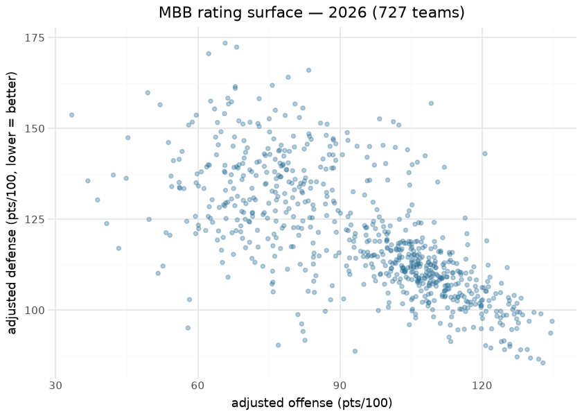
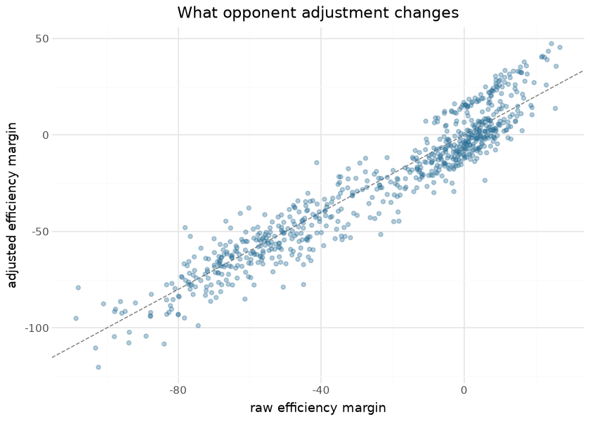

# MBB opponent-adjusted team ratings

Per-season opponent-adjusted team ratings publish on the `mbb_ratings`
release tag: offensive and defensive efficiency (`adj_o` / `adj_d`,
points per 100 possessions) adjusted for opponent quality, plus adjusted
tempo, a net rating (`adj_em`), and its z-score. The engine is the
sdv-py MBB prediction stack’s iterative opponent adjustment — the
em-scale fixed-point solver — so a team’s number reflects who it played,
not just what it scored. Ratings are recomputed from scratch (not
incrementally updated) on every run, so late corrections to the
underlying published pbp/box data propagate automatically.

The model deliberately has no hidden machinery to explain: it is a
fixed-point solve over the season-to-date game matrix. Its “features”
are the game results themselves, its attribution is the O/D
decomposition it publishes, and its verification is external — the
engine’s oracle gates in sdv-py hold the season ordering against
KenPom/Torvik-class references where they are trained. What this
document adds is the render-time view of the published assets a consumer
actually downloads: internal-consistency checks, the structure of the
rating surface, and identified team-level results.

## Training data

| Published mbb_ratings assets, by season |  |  |  |
|----|----|----|----|
| computed at render time from the release; adj_em is mean-zero by construction |  |  |  |
| season | teams | team_games | mean_adj_em |
| 2020 | 658 | 11,514 | −21.271 |
| 2021 | 493 | 8,566 | −11.456 |
| 2022 | 679 | 11,930 | −22.178 |
| 2023 | 706 | 12,440 | −23.360 |
| 2024 | 717 | 12,480 | −23.974 |
| 2025 | 700 | 12,572 | −24.646 |
| 2026 | 727 | 12,598 | −25.751 |

&#10;

Inputs are the published season pbp/box assets of this repository — the
ratings sit downstream of the same daily pipeline that publishes the
data they are computed from, which is what keeps them reproducible.

## Exploratory data analysis

| Internal consistency — 2026           |          |
|---------------------------------------|----------|
| check                                 | value    |
| mean adj_em (should be ~0)            | −25.7506 |
| corr(adj_em, raw margin)              | 0.9544   |
| corr(adj_em, adj_em_z) (should be ~1) | 1.0000   |

&#10;

The vertical spread between raw and adjusted margin is the point of the
model: mid-major teams with gaudy raw margins move down,
power-conference teams with brutal schedules move up, and the
correlation between the two — strong but visibly below 1 — is the honest
measure of how much schedule matters in a 360+ team league where most
games are intra-tier.

## Evaluation

The engine’s publish gates live in sdv-py where it is trained (external
ordering checks against reference systems; the NCAA RAPM repos hold the
same family of engines to Torvik at Spearman ≥ 0.93). At the asset
level, the render-time check available without an external feed is
**predictive consistency**: within a season, adj_em should order
head-to-head margins better than raw margin does, and across seasons a
program’s rating should be sticky. The cross-season stability computed
from the published assets:

| Program stickiness — adj_em season S vs S+1, same team |  |  |
|----|----|----|
| published-asset check; programs are persistent, rosters are not — the gap is roster turnover |  |  |
| season | yoy_pearson | teams |
| 2020 | 0.896 | 410 |
| 2021 | 0.883 | 423 |
| 2022 | 0.884 | 556 |
| 2023 | 0.884 | 578 |
| 2024 | 0.890 | 572 |
| 2025 | 0.897 | 577 |

&#10;

## Results

| Top 25 — 2026 adjusted ratings |  |  |  |  |  |  |  |
|----|----|----|----|----|----|----|----|
|  | Team | Rk | AdjO | AdjD | AdjEM | AdjT | G |
|  | Michigan Wolverines | 1 | 132.9 | 85.5 | 47.4 | 71.7 | 40 |
|  | Duke Blue Devils | 2 | 131.9 | 86.5 | 45.4 | 66.3 | 38 |
|  | Arizona Wildcats | 3 | 130.2 | 86.8 | 43.4 | 70.8 | 39 |
|  | Illinois Fighting Illini | 4 | 134.5 | 93.7 | 40.8 | 67.0 | 37 |
|  | Florida Gators | 5 | 129.5 | 89.2 | 40.4 | 70.6 | 35 |
|  | Houston Cougars | 6 | 127.4 | 87.1 | 40.2 | 63.9 | 37 |
|  | Iowa State Cyclones | 7 | 128.1 | 89.1 | 39.0 | 67.9 | 37 |
|  | Purdue Boilermakers | 8 | 134.8 | 96.9 | 37.8 | 65.3 | 39 |
|  | UConn Huskies | 9 | 125.9 | 90.0 | 35.8 | 65.5 | 40 |
|  | Gonzaga Bulldogs | 10 | 124.8 | 89.1 | 35.6 | 69.7 | 35 |
|  | Michigan State Spartans | 11 | 125.8 | 90.6 | 35.2 | 67.2 | 35 |
|  | Alabama Crimson Tide | 12 | 132.4 | 99.0 | 33.5 | 73.7 | 35 |
|  | Tennessee Volunteers | 13 | 124.6 | 91.6 | 33.1 | 66.5 | 37 |
|  | Vanderbilt Commodores | 14 | 129.9 | 97.0 | 33.0 | 69.6 | 36 |
|  | St. John's Red Storm | 15 | 124.1 | 91.3 | 32.7 | 70.2 | 37 |
|  | Louisville Cardinals | 16 | 127.3 | 94.9 | 32.4 | 70.3 | 35 |
|  | Nebraska Cornhuskers | 17 | 121.9 | 89.6 | 32.3 | 67.6 | 35 |
|  | Virginia Cavaliers | 18 | 126.3 | 94.7 | 31.6 | 67.3 | 36 |
|  | Arkansas Razorbacks | 19 | 131.0 | 99.4 | 31.6 | 72.7 | 37 |
|  | Texas Tech Red Raiders | 20 | 127.7 | 96.5 | 31.2 | 67.0 | 34 |
|  | Kansas Jayhawks | 21 | 120.8 | 90.3 | 30.5 | 68.8 | 35 |
|  | BYU Cougars | 22 | 128.5 | 98.7 | 29.9 | 70.7 | 35 |
|  | Iowa Hawkeyes | 23 | 127.3 | 97.6 | 29.7 | 63.3 | 37 |
|  | Wisconsin Badgers | 24 | 127.9 | 99.4 | 28.5 | 70.2 | 35 |
|  | Kentucky Wildcats | 25 | 124.3 | 95.9 | 28.4 | 68.8 | 36 |

&#10;

## Provenance & reproducibility

- **Computed from:** this repository’s published season pbp/box assets,
  seasons listed in the corpus table; recomputed in full on every run.
- **Engine:** the sdv-py MBB prediction stack’s iterative opponent
  adjustment (em-scale fixed point); engine training + oracle gates live
  in sdv-py.
- **Pipeline:** `scripts/mbb_models.sh 01` → stage
  `python/mbb_model_01_ratings.py` (wired via `mbb_models_cron.yml`);
  each publish writes a card sidecar
  ([`mbb_models_eval_card.json`](mbb_models_eval_card.json)). Single
  home: `models/manifest.yaml`.
- **Rebuild this document:** `scripts/render_model_docs.sh` (Quarto →
  GFM; `uv sync --group docs`). Requires network for the release
  download and the logo CDN.

## Avenues for improvement & open issues

- **Preseason priors** — blend the recruiting/returning-production prior
  into early-season ratings instead of starting from a flat matrix.
- **Home/travel modeling** — altitude and travel distance are unmodeled.
- **Known issue:** Spearman-style external checks are scale-blind; the
  level bands that catch scale bugs live in the sdv-py gates, not here.
