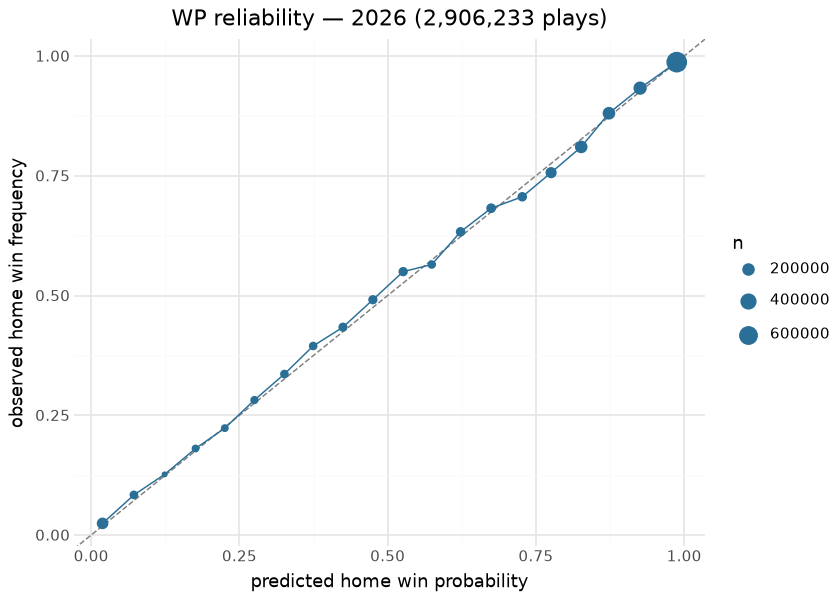
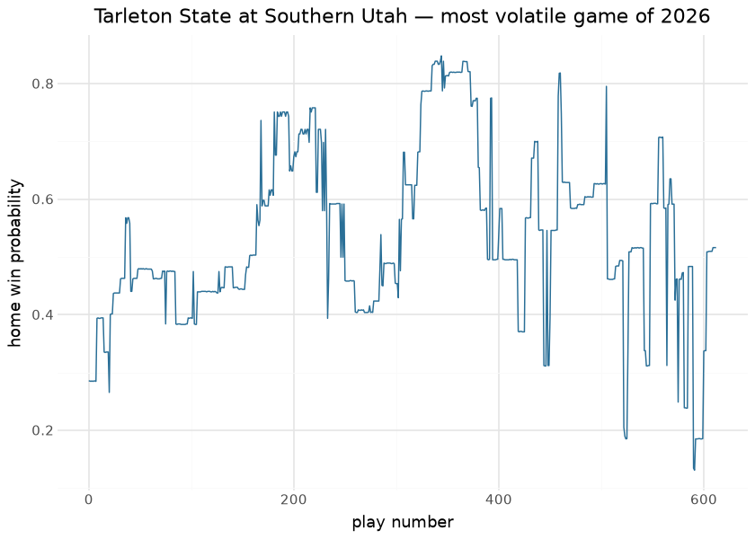

# MBB in-game win probability — pbp enrichment

The MBB rule-era win-probability suite (trained, bundled, and
oracle-gated in sdv-py) is applied **in place** to every published
season of `espn_mens_college_basketball_pbp`: `home_win_prob` and the
pregame prior (`pregame_home_prob`) are added to each play with every
original column preserved. The published pbp itself is how the model
reaches consumers — there is no separate WP asset to fall out of sync
with the plays.

The models are rule-era XGBoost classifiers over game state (score
margin, time remaining, possession); era-specific boosters absorb rule
changes across the 2003-present span. Operationally, the enrichment runs
post-publish in `scripts/daily_mbb_data_processor.sh` because a recorded
incident showed the nightly publish silently stripping the WP columns —
re-application is unconditional for that reason, and the incident is why
this stage exists at all.

This document is the model’s **out-of-band evaluation**: it downloads
one full published season at render time and holds the in-game
probabilities against each game’s realized outcome. That is a genuine
test of the applied model on the shipped data — if the enrichment ever
regressed, went stale, or was stripped, this document’s calibration
section would show it on the next render.

## Evaluation data

| Published season evaluated at render time — 2026 |  |  |  |  |
|----|----|----|----|----|
| every play of the published pbp joined to its game's realized outcome (ties from data artifacts excluded) |  |  |  |  |
| season | enriched_plays | games | home_win_rate | mean_home_win_prob |
| 2026 | 2,906,233 | 6256 | 66.7% | 0.6687 |

&#10;

The mean predicted probability sitting close to the realized home-win
rate is the zeroth-order calibration check; the college home floor is
one of the strongest in sports and both numbers reflect it.

## Calibration

| Out-of-band calibration — 2026 published season |        |
|-------------------------------------------------|--------|
| metric                                          | value  |
| Brier score (all plays)                         | 0.1212 |
| 20-bin calibration MAE                          | 0.0106 |
| baseline Brier (constant home-win rate)         | 0.2209 |

&#10;

| Brier by period — uncertainty should resolve as the game progresses |  |  |
|----|----|----|
| a well-behaved WP model gets sharper (lower Brier) in later periods |  |  |
| period_number | plays | brier |
| 1 | 1,391,108 | 0.1540 |
| 2 | 1,491,780 | 0.0903 |
| 3 | 19,848 | 0.1496 |

&#10;

| Pregame vs in-game — the value the enrichment adds over the prior |        |
|-------------------------------------------------------------------|--------|
| model                                                             | brier  |
| pregame prior (one prob per game)                                 | 0.1874 |
| in-game WP (all plays)                                            | 0.1212 |

&#10;

The reliability diagram hugging the diagonal, the per-period Brier
falling monotonically, and the in-game model beating its own pregame
prior are the three signatures of a healthy applied WP surface. The
volatile-game trace is the demonstration consumers care about: the
column tells the story of a comeback without any narrative input.

## Provenance & reproducibility

- **Model:** rule-era XGBoost WP suite trained, bundled, and
  oracle-gated in sdv-py (score margin, time, possession features; era
  boosters across 2003-present).
- **Applied to:** every published season of
  `espn_mens_college_basketball_pbp`, in place, columns
  `home_win_prob` + `pregame_home_prob`; re-application is unconditional
  in `scripts/daily_mbb_data_processor.sh` (recorded strip incident).
- **Pipeline:** `scripts/mbb_models.sh 03` → stage
  `python/mbb_model_03_wp_enrich.py -s <season> -e <season>`. Single
  home: `models/manifest.yaml`.
- **This document** evaluates the published season downloaded at render
  time (~90 MB) — the exact frame consumers read.
- **Rebuild:** `scripts/render_model_docs.sh` (Quarto → GFM;
  `uv sync --group docs`).

## Avenues for improvement & open issues

- **Possession-state features** — foul counts, bonus state, and timeout
  inventory are absent from the WP inputs.
- **Known issue (recorded incident):** the nightly publish silently
  strips WP columns, which is why re-application is unconditional —
  moving enrichment into the publish step itself would remove the window
  where a freshly published season briefly lacks WP.
- **Season-holdout curve** — this document evaluates the applied model
  in-era; rendering the same calibration for an era the booster never
  saw would bound era-transfer error explicitly.
