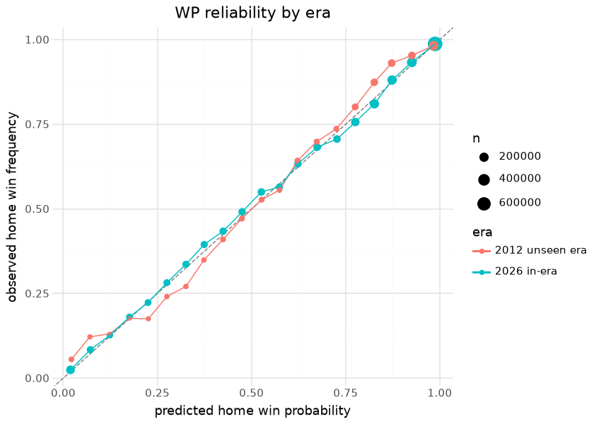

# MBB in-game win probability — pbp enrichment

The MBB rule-era win-probability suite (trained, bundled, and
oracle-gated in sdv-py) is applied **in place** to every published
season of `espn_mens_college_basketball_pbp`: `home_win_prob` and the
pregame prior (`pregame_home_prob`) are added to each play with every
original column preserved. The published pbp itself is how the model
reaches consumers — there is no separate WP asset to fall out of sync
with the plays.

The model is an XGBoost classifier over game state — score margin,
seconds left (and its square root), the pregame logit, and possession —
fit on a single season (2023). Operationally the enrichment **is** the
pbp publisher: `scripts/daily_mbb_data_processor.sh` builds the plain
season pbp into the tree and never uploads it; stage
`mbb_model_03_wp_enrich` reads the tree pbp/schedules/team_box, appends
the two columns and publishes parquet+csv+rds; and
`mbb_data_build.publish` refuses any pbp parquet without finite WP
columns, asserted on the file about to upload. That design closes a
recorded incident: the old publish-plain-then-re-enrich order stripped
the columns off the release on every nightly, and the 2026-08-26
whole-history republish stripped 2003–2023 outright (2024–2026 were
re-enriched by the in-season nightly). Until those seasons are
republished, this document computes the holdout era’s probabilities
itself and says so.

This document is the model’s **out-of-band evaluation**: it downloads a
full published season at render time and holds the in-game probabilities
against each game’s realized outcome — first in-era, then for an era the
booster never saw. If the enrichment ever regressed, went stale, or was
stripped, the calibration sections below would show it on the next
render.

## Evaluation data

| Published season evaluated at render time — 2026 |  |  |  |  |
|----|----|----|----|----|
| every play of the published pbp joined to its game's realized outcome (ties from data artifacts excluded) |  |  |  |  |
| season | enriched_plays | games | home_win_rate | mean_home_win_prob |
| 2026 | 2,906,233 | 6256 | 66.7% | 0.6687 |

&#10;

The mean predicted probability sitting close to the realized home-win
rate is the zeroth-order calibration check; the college home floor is
one of the strongest in sports and both numbers reflect it.

## Calibration

| Out-of-band calibration — 2026 published season |        |
|-------------------------------------------------|--------|
| metric                                          | value  |
| Brier score (all plays)                         | 0.1212 |
| 20-bin calibration MAE                          | 0.0106 |
| baseline Brier (constant home-win rate)         | 0.2209 |

&#10;

| Brier by period — uncertainty should resolve as the game progresses |  |  |
|----|----|----|
| a well-behaved WP model gets sharper (lower Brier) in later periods |  |  |
| period_number | plays | brier |
| 1 | 1,391,108 | 0.1540 |
| 2 | 1,491,780 | 0.0903 |
| 3 | 19,848 | 0.1496 |

&#10;

| Pregame vs in-game — the value the enrichment adds over the prior |        |
|-------------------------------------------------------------------|--------|
| model                                                             | brier  |
| pregame prior (one prob per game)                                 | 0.1874 |
| in-game WP (all plays)                                            | 0.1212 |

&#10;

The reliability diagram hugging the diagonal, the per-period Brier
falling monotonically, and the in-game model beating its own pregame
prior are the three signatures of a healthy applied WP surface. The
volatile-game trace is the demonstration consumers care about: the
column tells the story of a comeback without any narrative input.

## Unseen-era holdout

Holdout season **2012** — 1,115,779 plays in 3,440 games; probabilities
from probabilities computed at render time – the release asset lacks the
WP columns.

| Era transfer — the same booster in-era and on an era it never saw |  |  |  |  |  |  |
|----|----|----|----|----|----|----|
| the calibration-MAE gap between the rows is the era-transfer error, bounded here rather than assumed |  |  |  |  |  |  |
| era | plays | brier | baseline_brier | skill_vs_baseline | calibration_mae_20bin | pregame_brier |
| 2026 (in-era) | 2,906,233 | 0.1212 | 0.2209 | 45.1% | 0.0106 | 0.1874 |
| 2012 (unseen: 35-second shot clock, old three-point line) | 1,115,779 | 0.1242 | 0.2155 | 42.3% | 0.0255 | 0.1768 |

&#10;

The booster sees only game state, so what an unseen era tests is whether
“down 6 with 4:00 left” meant the same thing under a 35-second clock.
The table bounds that explicitly: the skill-versus-baseline and
calibration MAE of the old era sit next to the in-era numbers rather
than being assumed equal. The pregame prior also moves across eras — it
is an as-of team-rating model over that season’s own results — so the
holdout tests the whole applied surface, not just the tree.

## Provenance & reproducibility

- **Model:** XGBoost in-game WP over game state (score margin, seconds
  left, its square root, pregame logit, possession), fit on the 2023
  season, bundled and oracle-gated in sdv-py
  (`mbb/models/mbb_in_game_wp.ubj`).
- **Applied to:** every published season of
  `espn_mens_college_basketball_pbp`, in place, columns
  `home_win_prob` + `pregame_home_prob`, by the enrichment stage — the
  pbp asset’s only publisher.
  `mbb_data_build.publish.assert_wp_enriched` refuses any pbp parquet
  missing the columns or below a 0.999 finite-rate floor (observed 1.0
  on 2024–2026), asserted on the file about to upload.
- **Pipeline:** `scripts/mbb_models.sh 03` → stage
  `python/mbb_model_03_wp_enrich.py -s <season> -e <season> --base ../mbb`,
  wired at the end of `scripts/daily_mbb_data_processor.sh` (after
  schedules + team_box exist in the tree). Single home:
  `models/manifest.yaml`.
- **Release state (2026-09-01):** 2024–2026 carry the columns; 2003–2023
  lost them to the 2026-08-26 whole-history republish and need one
  `mbb_model_03_wp_enrich -s 2003 -e 2023` republish. This document
  falls back to computing the holdout era itself while that is
  outstanding.
- **This document** evaluates two published seasons downloaded at render
  time (~90 MB + ~50 MB) — the exact frames consumers read.
- **Rebuild:** `scripts/render_model_docs.sh` (Quarto → GFM;
  `uv sync --group docs`).

## Avenues for improvement & open issues

- **Possession-state features** — foul counts, bonus state, and timeout
  inventory are absent from the WP inputs.
- **Resolved (2026-09-01, PR \#25):** the nightly publish no longer
  strips the WP columns — the enrichment stage is the pbp asset’s only
  publisher and the publish path refuses an un-enriched pbp parquet, so
  no publish window exists in which a season lacks WP. The 2003–2023
  seasons stripped by the 2026-08-26 history republish still need the
  one-off republish listed above.
- **Resolved (2026-09-01, PR \#25):** season-holdout curve — the
  unseen-era section above renders the same calibration for a season the
  booster never saw and reports the era-transfer error as a number.
